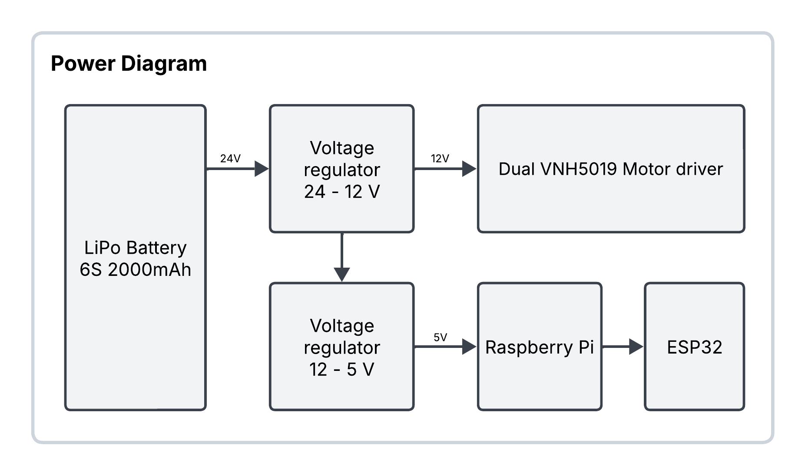

# Pioneer Robot Project

## Description

The goal of this project, conducted at the Center for Automation and Robotics (CAR), is to update the differential robot Pioneer 3-AT to ROS2. The robot was previously running on ROS1. This update involves using a Raspberry Pi 5 and an ESP32, which communicate with each other using microRos.

## Project Structure

- [**3d_files**](3d_files/): contains the 3D models used in the project.
- [**docs**](docs/): documentation related to the project.
- [**legacy**](legacy/): contains older versions and historical files.
- [**main**](main/): main codebase and core functionalities.
- [**projects**](projects/): specific projects or experiments related to the robot.
- [**pcb_design**](pcb_design/): contains the design files for the PCB. See [`pcb_design/README.md`](pcb_design/README.md) for more details.

## Usage

1. Follow the instructions in [`pcb_design/README.md`](pcb_design/README.md) for PCB manufacturing and assembly.
2. Program the ESP32 using the files in the [`main`](main) folder.
3. Access the Raspberry Pi via SSH:

   ```bash
   ssh robcib@192.168.2.120
   ```

4. Launch the ROS2 bringup:

   ```bash
   ros2 launch lynxmotion_care robot_bringup.launch.py
   ```

## Components

### Main Components

- **Battery**: LiPo 6S 20000 mAh.
- **Dual VNH5019 Motor Driver Shield**: refer to [`docs/dual_vnh5019_motor_driver_shield.pdf`](docs/dual_vnh5019_motor_driver_shield.pdf) for specifications
- **ESP32**: Node MCU-32S, powered via USB, handles low-level motor control.
- **Motors**: 4 DC motors, paired 2 by 2 with a belt. Each side has one motor with encoders (500 ticks), a 38.3:1 gearbox, and a 1.3:1 pulley reduction
- **Raspberry Pi 5B**: acts as the onboard computer.
- **Voltage Regulator**: 24V to 12V for motor power, 5V for Raspberry Pi power.

### Power Connection Diagram

For detailed connection diagrams, refer to the schematic in [`pcb_design/RedLeaderSchematic.pdf`](pcb_design/RedLeaderSchematic.pdf).

